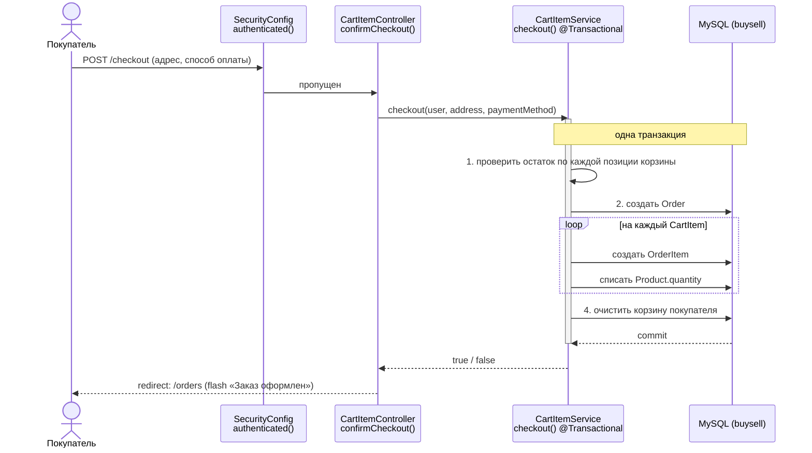
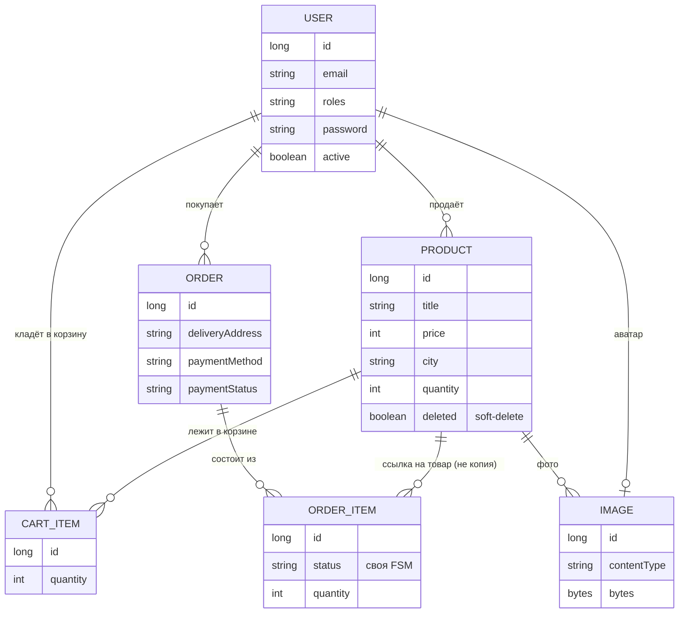

# Как устроен BUYSELL

> Архитектурный обзор · актуально на 27.08.2026

Классическое серверное Spring MVC приложение: доска объявлений с корзиной, оформлением заказа и раздельным статусом на каждую позицию — чтобы несколько продавцов могли участвовать в одном заказе покупателя, не мешая друг другу.

- Spring Boot 4.1 · Java 21
- `com.marketHub.marketplace`
- github.com/Dikii45/MarketPlace

## Оглавление

1. [Обзор](#1-обзор)
2. [Стек](#2-стек)
3. [Слои приложения](#3-слои-приложения)
4. [Модель данных](#4-модель-данных)
5. [Безопасность](#5-безопасность)
6. [Сценарии](#6-сценарии)
7. [Карта эндпоинтов](#7-карта-эндпоинтов)
8. [Фронтенд](#8-фронтенд)
9. [Инженерные заметки](#9-инженерные-заметки)

## 1. Обзор

Marketplace — доска объявлений типа «купи-продай»: пользователь выставляет товар с фотографиями и остатком на складе, другой — кладёт в корзину и оформляет заказ. Рендеринг полностью серверный (Freemarker), без отдельного API и SPA-фронтенда.

**Ключевая идея данных.** Заказ (`Order`) может включать товары разных продавцов одновременно. Общие для заказа поля — адрес и способ оплаты — лежат на `Order`; а статус жизненного цикла («новый → подтверждён → отправлен → получен») — на каждой позиции (`OrderItem`) отдельно. Так продавец A видит и двигает статус только своих строк в заказе, не трогая то, что в этом же заказе продаёт продавец B.

**Состояние проекта.** Учебный/pet-проект в активной разработке. Корзина и чекаут реализованы и покрыты собственным ТЗ (`docs/cart-checkout-tz.md`) end-to-end. 26–27 августа закрыта уязвимость авторизации на удаление товара, введён soft-delete и самоочистка корзины от удалённых товаров — подробности в §9.

## 2. Стек

Maven, Spring Boot `4.1.0` parent, Java `21`. Один модуль, без отдельного API-слоя — контроллеры сразу отдают HTML.

| Роль | Технология | Детали |
|---|---|---|
| Веб / MVC | Spring Web MVC | Контроллеры + Freemarker вместо Thymeleaf |
| Шаблоны | Freemarker (`.ftlh`) | Общие макросы в `common.ftlh`: head/topbar/productCard/footer |
| Данные | Spring Data JPA / Hibernate | `ddl-auto=update`, `show-sql=true` |
| СУБД | MySQL | `jdbc:mysql://localhost:3306/buysell` |
| Auth | Spring Security | Form login, BCrypt(strength 8), `@PreAuthorize` |
| Boilerplate | Lombok | `@Data` / `@RequiredArgsConstructor` везде |
| Файлы | Multipart upload | до 100 МБ; изображения хранятся как BLOB в БД, не на диске |
| Порт | `:8081` | `server.port=8081` |

## 3. Слои приложения

Стандартная трёхслойная схема — `@Controller → @Service → @Repository` — плюс `@ControllerAdvice`, который на каждый запрос подмешивает счётчик корзины в модель. Диаграмма ниже — не абстрактная схема слоёв, а конкретный путь одного реального запроса: оформление заказа.

Если на шаге проверки остатка не хватает хотя бы по одной позиции — `checkout()` возвращает `false` до какой-либо записи, заказ не создаётся вовсе (не «частично»), а покупатель попадает обратно на `/cart` с ошибкой.

### 3.1 Контроллеры

| Класс | Отвечает за |
|---|---|
| `ProductController` | каталог, карточка товара, создание/удаление/пополнение остатка |
| `CartItemController` | корзина: добавить/убрать/изменить количество, чекаут |
| `OrderController` | «Мои покупки» / «Мои продажи», смена статуса позиции заказа |
| `UserController` | регистрация, логин, профиль, аватар, смена пароля |
| `AdminController` | панель администратора: бан, роли, удаление пользователей |
| `ImageController` | отдача байтов картинки по id (`@RestController`) |
| `GlobalModelAttributes` | `@ControllerAdvice` — кладёт `cartCount` в модель каждого запроса |

## 4. Модель данных

Шесть сущностей. Изображения — отдельная сущность-BLOB, а не файлы на диске: и товар, и аватар пользователя ссылаются на `Image`.

`OrderItem` хранит статус и количество на момент оформления, но *ссылается* на живой `Product`, а не копирует его поля — поэтому переименование или смена цены товара задним числом видна и в старых заказах.

### 4.1 Что стоит иметь в виду

- **Enum-поля всегда `@Enumerated(EnumType.STRING)`** — без этого Hibernate хранит порядковый номер, что ломается при любой правке порядка констант.
- **Картинки — BLOB в таблице `images`**, а не файлы на диске: проще для pet-проекта, но значит, что размер БД растёт вместе с каталогом (лимит загрузки — 100 МБ на файл).
- **Soft-delete только на `Product`** (флаг `deleted`). У остальных сущностей — обычное каскадное удаление через JPA-связи.

## 5. Безопасность

`SecurityConfig`: form login на `/login`, BCrypt(8), роли через `@ElementCollection<Role>` на пользователе (`ROLE_USER` / `ROLE_ADMIN`). `AdminController` закрыт целиком через `@PreAuthorize("hasAuthority('ROLE_ADMIN')")` на классе.

### 5.1 Кто что может

| Область | Гость | Пользователь | Владелец | Админ |
|---|---|---|---|---|
| Просмотр каталога и товара (GET) | открыто | открыто | открыто | открыто |
| Создать товар | — | свои | — | да |
| Удалить / пополнить товар | — | — | свои | любые |
| Корзина, чекаут, заказы | — | свои | — | — |
| Менять статус позиции заказа | — | — | товар свой | — |
| Панель `/admin`, бан, роли | — | — | — | да |

С 26.08 маска `permitAll` на `/product/**` сужена до GET — POST-запросы (создать / удалить / пополнить) требуют аутентификации по умолчанию, а владение проверяется в самом сервисе. Раньше это было не так — см. §9.

## 6. Сценарии

### 6.1 Корзина → заказ

Добавить в корзину → `/cart` (список, суммы, степпер количества) → `/checkout` (адрес + способ оплаты) → один `Order` на всю корзину, по одному `OrderItem` на позицию, списание остатка, очистка корзины. Если остатка не хватает хотя бы по одной строке — не оформляется ничего.

### 6.2 Статус позиции заказа — конечный автомат

| Из статуса | Разрешённые переходы |
|---|---|
| `NEW` | любой, кроме `NEW` |
| `CONFIRMED` | `SENT`, `RECEIVED`, `CANCELLED` |
| `SENT` | `RECEIVED`, `CANCELLED` |
| `RECEIVED` | `CANCELLED` |
| `CANCELLED` | — терминальный |

Меняет только продавец соответствующей позиции (`orderItem.getProduct().getUser()`), проверка перед единственным `save()` — сознательно, чтобы не повторить старый баг с безусловной перезаписью статуса.

### 6.3 Жизненный цикл товара

Создание (с фото и остатком) → показывается в каталоге, пока `quantity > 0` и не `deleted` → при обнулении остатка прячется из общего каталога, но остаётся у продавца на `/user/{id}` для пополнения → `restock` возвращает в каталог → `delete` — soft-delete, продукт помечается `deleted=true`, перестаёт открываться по прямой ссылке, а его остатки в чужих корзинах вычищаются при следующем обращении к корзине.

## 7. Карта эндпоинтов

Полный список маршрутов по контроллерам. «Доступ» — фактическая проверка в коде на сегодня (SecurityConfig + сервисный слой), не то, что видно из одной аннотации.

| Метод | Путь | Контроллер | Доступ |
|---|---|---|---|
| GET | `/` | Product | все |
| GET | `/product/{id}` | Product | все |
| POST | `/product/create` | Product | залогинен |
| POST | `/product/delete/{id}` | Product | владелец/админ |
| POST | `/product/restock/{id}` | Product | владелец/админ |
| GET | `/cart` | CartItem | залогинен |
| POST | `/cart/add/{productId}` | CartItem | залогинен, не свой товар |
| POST | `/cart/remove/{productId}` | CartItem | залогинен |
| POST | `/cart/update/{productId}` | CartItem | залогинен |
| GET | `/checkout` | CartItem | залогинен, корзина не пуста |
| POST | `/checkout` | CartItem | залогинен |
| GET | `/orders` | Order | залогинен |
| POST | `/orders/items/{itemId}/status` | Order | продавец позиции |
| GET | `/login` · `/registration` | User | все |
| POST | `/registration` | User | все |
| GET | `/user/{id}` | User | все |
| GET/POST | `/account, /account/avatar, /account/password, /account/delete` | User | залогинен, себя |
| GET | `/images/{id}` | Image | все |
| * | `/admin, /admin/user/**` | Admin | ROLE_ADMIN |

## 8. Фронтенд

Никакого фреймворка — Freemarker + один `site.css` + один `site.js`. Общие блоки вынесены в макросы `common.ftlh`, которые импортирует каждая страница.

| Макрос / шаблон | Роль |
|---|---|
| `c.head` | `<title>`, подключение `site.css` / `site.js` |
| `c.topbar` | шапка: поиск, иконка корзины с бейджем `cartCount`, меню аккаунта |
| `c.productCard` | карточка товара в сетке: фото, цена, оверлей «Товар закончился» |
| `c.footer` | подвал |
| `products / product-info` | каталог с поиском по названию · карточка товара, галерея, действия владельца |
| `cart / checkout / orders` | корзина со степпером · форма адреса и оплаты · «Мои покупки» + «Мои продажи» со `<select>` статуса |
| `user-info / account / user-edit` | витрина продавца + форма «Добавить товар» · профиль/аватар/пароль · редактирование ролей (админ) |
| `login / registration / admin` | вход · регистрация с подтверждением пароля · список пользователей с баном |

## 9. Инженерные заметки

Не список всех коммитов — только решения, которые стоит помнить при следующей правке этой части кода.

> **✓ исправлено · 26–27.08 — Broken Access Control на `/product/delete/{id}`, устаревшие ссылки в корзине**
>
> `SecurityConfig` держал весь `/product/**` в `permitAll()`, а `ProductController.deleteProduct` не проверял ни аутентификацию, ни владельца — удалить чужой товар мог кто угодно, даже не залогинившись.
>
> Фикс: `permitAll` сужен до `GET /product/**`; `deleteProducts(id, principal)` теперь проверяет `user.isAdmin() || product.getUser().getId().equals(user.getId())` — по образцу уже существовавшей проверки в `restockProduct`. Заодно удаление стало soft-delete (`deleted=true`), что защищает историю заказов от осиротевших ссылок, а `checkout()` явно отклоняет заказ целиком, если товар успели удалить, пока он лежал в чужой корзине. `CartItemService.getCartItems()` дополнительно сам вычищает из корзины записи на уже удалённые товары при каждом обращении — карточка не «зависает» в интерфейсе.

> **◐ открыто — флаг `deleted` учтён не везде**
>
> `ProductService.listProducts`, `productInfo` и корзина (`CartItemService.getCartItems`) его фильтруют, а вот `UserController` — страница продавца «Мои товары» (`user.getProducts()`, сырая JPA-связь) — нет. Удалённый товар продолжает висеть в списке продавца бесконечно.

### 9.1 Зафиксированные грабли (из ТЗ по корзине)

- `deleteAllByUser` / `deleteByUserAndProduct` — derived delete-запросы Spring Data падают `TransactionRequiredException` без явного `@Transactional` на вызывающем методе, даже если код компилируется без единой ошибки.
- Смена набора колонок/enum-значений у `orders` при живом `ddl-auto=update` оставляет старый `CHECK`-constraint в MySQL — Hibernate не пересоздаёт ограничения на существующих колонках, лечится только пересозданием таблицы.
- Правило перехода статусов реализовано одним `boolean canMoveTo` и единственным `save()` после — раньше был безусловный `setStatus`/`save` после `switch`, который проверку игнорировал.

---

*BUYSELL · архитектурный обзор · по коду репозитория Dikii45/MarketPlace на 27.08.2026*
