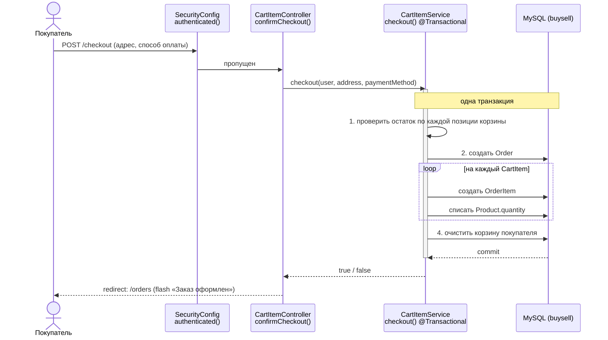
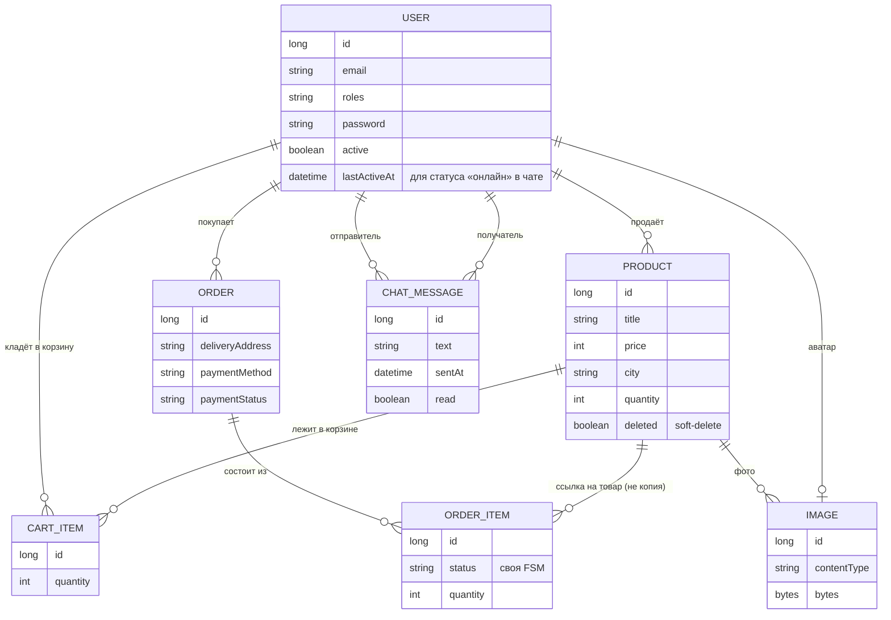
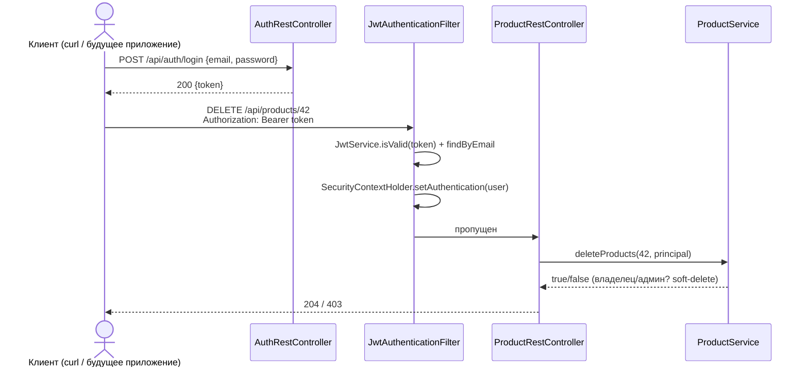

# Как устроен BUYSELL

> Архитектурный обзор · актуально на 07.09.2026

Классическое серверное Spring MVC приложение: доска объявлений с корзиной, оформлением заказа и раздельным статусом на каждую позицию — чтобы несколько продавцов могли участвовать в одном заказе покупателя, не мешая друг другу.

- Spring Boot 4.1 · Java 21
- `com.marketHub.marketplace`
- github.com/Dikii45/MarketPlace

## Оглавление

1. [Обзор](#1-обзор)
2. [Стек](#2-стек)
3. [Слои приложения](#3-слои-приложения)
4. [Модель данных](#4-модель-данных)
5. [Безопасность](#5-безопасность)
6. [Сценарии](#6-сценарии)
7. [Карта эндпоинтов](#7-карта-эндпоинтов)
8. [Фронтенд](#8-фронтенд)
9. [REST API и JWT](#9-rest-api-и-jwt)
10. [Тестирование и CI/CD](#10-тестирование-и-cicd)

## 1. Обзор

Marketplace — доска объявлений типа «купи-продай»: пользователь выставляет товар с фотографиями и остатком на складе, другой — кладёт в корзину и оформляет заказ. Рендеринг полностью серверный (Freemarker), без отдельного API и SPA-фронтенда.

**Ключевая идея данных.** Заказ (`Order`) может включать товары разных продавцов одновременно. Общие для заказа поля — адрес и способ оплаты — лежат на `Order`; а статус жизненного цикла («новый → подтверждён → отправлен → получен») — на каждой позиции (`OrderItem`) отдельно. Так продавец A видит и двигает статус только своих строк в заказе, не трогая то, что в этом же заказе продаёт продавец B.

**Состояние проекта.** Учебный/pet-проект в активной разработке. Корзина и чекаут реализованы и покрыты собственным ТЗ (`docs/cart-checkout-tz.md`) end-to-end. 26–27 августа закрыта уязвимость авторизации на удаление товара, введён soft-delete и самоочистка корзины от удалённых товаров. С тех пор добавлены: чат покупатель↔продавец, REST API поверх каталога товаров с отдельной JWT-авторизацией (§9), тестовый набор на четырёх уровнях и CI/CD в GitHub Actions (§10).

## 2. Стек

Maven, Spring Boot `4.1.0` parent, Java `21`. Один модуль, без отдельного API-слоя — контроллеры сразу отдают HTML.

| Роль | Технология | Детали |
|---|---|---|
| Веб / MVC | Spring Web MVC | Контроллеры + Freemarker вместо Thymeleaf |
| Шаблоны | Freemarker (`.ftlh`) | Общие макросы в `common.ftlh`: head/topbar/productCard/footer |
| Данные | Spring Data JPA / Hibernate | `ddl-auto=update`, `show-sql=true` |
| СУБД | MySQL | `jdbc:mysql://localhost:3306/buysell` |
| Auth (сайт) | Spring Security | Form login, сессия, BCrypt(strength 8), `@PreAuthorize` |
| Auth (API) | Spring Security + JJWT | Отдельная stateless-цепочка на `/api/**`, токен из заголовка `Authorization` |
| API-документация | springdoc-openapi | Swagger UI на `/swagger-ui.html`, спецификация на `/v3/api-docs` |
| Boilerplate | Lombok | `@Data` / `@RequiredArgsConstructor` везде |
| Файлы | Multipart upload | до 100 МБ; изображения хранятся как BLOB в БД, не на диске |
| Тесты | JUnit 5, Mockito, AssertJ, H2 | unit / repository / integration / controller — см. §10 |
| Порт | `:8081` | `server.port=8081` |
| Контейнеризация | Docker, Docker Compose | `Dockerfile` (multi-stage) + `docker-compose.yml` (app + MySQL) |
| CI/CD | GitHub Actions | тесты на каждый push/PR, публикация образа в ghcr.io на push в `main` |

## 3. Слои приложения

Стандартная трёхслойная схема — `@Controller → @Service → @Repository` — плюс `@ControllerAdvice`, который на каждый запрос подмешивает счётчик корзины в модель. Диаграмма ниже — не абстрактная схема слоёв, а конкретный путь одного реального запроса: оформление заказа.

Если на шаге проверки остатка не хватает хотя бы по одной позиции — `checkout()` возвращает `false` до какой-либо записи, заказ не создаётся вовсе (не «частично»), а покупатель попадает обратно на `/cart` с ошибкой.

### 3.1 Контроллеры

| Класс | Отвечает за |
|---|---|
| `ProductController` | каталог, карточка товара, создание/удаление/пополнение остатка |
| `CartItemController` | корзина: добавить/убрать/изменить количество, чекаут |
| `OrderController` | «Мои покупки» / «Мои продажи», смена статуса позиции заказа |
| `UserController` | регистрация, логин, профиль, аватар, смена пароля |
| `AdminController` | панель администратора: бан, роли, удаление пользователей |
| `ImageController` | отдача байтов картинки по id (`@RestController`) |
| `ChatController` | страница чата, отправка/опрос сообщений (AJAX, отдаёт готовый HTML-фрагмент) |
| `GlobalModelAttributes` | `@ControllerAdvice` — кладёт `cartCount` в модель и обновляет `lastActiveAt` на каждый запрос |
| `rest/AuthRestController` | `POST /api/auth/login` — выдаёт JWT |
| `rest/ProductRestController` | REST-версия каталога товаров (`/api/products/**`), поверх того же `ProductService` |

## 4. Модель данных

Семь сущностей. Изображения — отдельная сущность-BLOB, а не файлы на диске: и товар, и аватар пользователя ссылаются на `Image`.

`OrderItem` хранит статус и количество на момент оформления, но *ссылается* на живой `Product`, а не копирует его поля — поэтому переименование или смена цены товара задним числом видна и в старых заказах.

### 4.1 Что стоит иметь в виду

- **Enum-поля всегда `@Enumerated(EnumType.STRING)`** — без этого Hibernate хранит порядковый номер, что ломается при любой правке порядка констант.
- **Картинки — BLOB в таблице `images`**, а не файлы на диске: проще для pet-проекта, но значит, что размер БД растёт вместе с каталогом (лимит загрузки — 100 МБ на файл).
- **Soft-delete только на `Product`** (флаг `deleted`). У остальных сущностей — обычное каскадное удаление через JPA-связи.
- **`read` — зарезервированное слово в MySQL.** Поле `ChatMessage.read` пришлось замапить на колонку `is_read` через `@Column(name = "is_read")` — иначе `CREATE TABLE` падает с синтаксической ошибкой прямо на этом слове.

## 5. Безопасность

`SecurityConfig` держит **две** независимые цепочки (`SecurityFilterChain`), разделённые по пути через `securityMatcher` и упорядоченные `@Order`:

| | `apiSecurityFilterChain` (`@Order(1)`) | `securityFilterChain` (`@Order(2)`) |
|---|---|---|
| Область | `/api/**` | всё остальное |
| Сессия | нет (`STATELESS`) | обычная HTTP-сессия |
| CSRF | выключен (нет cookie — нечего подделывать) | включён |
| Вход | `Authorization: Bearer <JWT>` | форма `/login` |

`JwtAuthenticationFilter` встаёт перед `UsernamePasswordAuthenticationFilter` и на каждый запрос к `/api/**` проверяет токен: если валиден — кладёт `User` в `SecurityContextHolder` как `Authentication`. Так как `User implements UserDetails`, `Authentication.getName()` возвращает email — то же самое, что `Principal.getName()` при обычном логине по сессии. Поэтому `ProductRestController` дергает **те же самые** методы `ProductService` (`deleteProducts`, `restockProduct`, `saveProduct`), что и `ProductController` — владелец/админ-проверки и soft-delete работают одинаково для сайта и для API, без дублирования логики.

Роли — через `@ElementCollection<Role>` на пользователе (`ROLE_USER` / `ROLE_ADMIN`). `AdminController` закрыт целиком через `@PreAuthorize("hasAuthority('ROLE_ADMIN')")` на классе.

### 5.1 Кто что может

| Область | Гость | Пользователь | Владелец | Админ |
|---|---|---|---|---|
| Просмотр каталога и товара (GET) | открыто | открыто | открыто | открыто |
| Создать товар | — | свои | — | да |
| Удалить / пополнить товар | — | — | свои | любые |
| Корзина, чекаут, заказы | — | свои | — | — |
| Менять статус позиции заказа | — | — | товар свой | — |
| Панель `/admin`, бан, роли | — | — | — | да |

С 26.08 маска `permitAll` на `/product/**` сужена до GET — POST-запросы (создать / удалить / пополнить) требуют аутентификации по умолчанию, а владение проверяется в самом сервисе. Раньше весь `/product/**` был `permitAll()` целиком, и удалить чужой товар мог кто угодно, даже не залогинившись.

## 6. Сценарии

### 6.1 Корзина → заказ

Добавить в корзину → `/cart` (список, суммы, степпер количества) → `/checkout` (адрес + способ оплаты) → один `Order` на всю корзину, по одному `OrderItem` на позицию, списание остатка, очистка корзины. Если остатка не хватает хотя бы по одной строке — не оформляется ничего.

### 6.2 Статус позиции заказа — конечный автомат

| Из статуса | Разрешённые переходы |
|---|---|
| `NEW` | любой, кроме `NEW` |
| `CONFIRMED` | `SENT`, `RECEIVED`, `CANCELLED` |
| `SENT` | `RECEIVED`, `CANCELLED` |
| `RECEIVED` | `CANCELLED` |
| `CANCELLED` | — терминальный |

Меняет только продавец соответствующей позиции (`orderItem.getProduct().getUser()`), проверка перед единственным `save()` — сознательно, чтобы не повторить старый баг с безусловной перезаписью статуса.

### 6.3 Жизненный цикл товара

Создание (с фото и остатком) → показывается в каталоге, пока `quantity > 0` и не `deleted` → при обнулении остатка прячется из общего каталога, но остаётся у продавца на `/user/{id}` для пополнения → `restock` возвращает в каталог → `delete` — soft-delete, продукт помечается `deleted=true`, перестаёт открываться по прямой ссылке, а его остатки в чужих корзинах вычищаются при следующем обращении к корзине.

## 7. Карта эндпоинтов

Полный список маршрутов по контроллерам. «Доступ» — фактическая проверка в коде на сегодня (SecurityConfig + сервисный слой), не то, что видно из одной аннотации.

| Метод | Путь | Контроллер | Доступ |
|---|---|---|---|
| GET | `/` | Product | все |
| GET | `/product/{id}` | Product | все |
| POST | `/product/create` | Product | залогинен |
| POST | `/product/delete/{id}` | Product | владелец/админ |
| POST | `/product/restock/{id}` | Product | владелец/админ |
| GET | `/cart` | CartItem | залогинен |
| POST | `/cart/add/{productId}` | CartItem | залогинен, не свой товар |
| POST | `/cart/remove/{productId}` | CartItem | залогинен |
| POST | `/cart/update/{productId}` | CartItem | залогинен |
| GET | `/checkout` | CartItem | залогинен, корзина не пуста |
| POST | `/checkout` | CartItem | залогинен |
| GET | `/orders` | Order | залогинен |
| POST | `/orders/items/{itemId}/status` | Order | продавец позиции |
| GET | `/login` · `/registration` | User | все |
| POST | `/registration` | User | все |
| GET | `/user/{id}` | User | все |
| GET/POST | `/account, /account/avatar, /account/password, /account/delete` | User | залогинен, себя |
| GET | `/images/{id}` | Image | все |
| GET | `/chat/{userId}` | Chat | залогинен, не сам себе |
| POST | `/chat/{userId}/send` | Chat | залогинен, не сам себе |
| GET | `/chat/{userId}/poll` | Chat | залогинен, не сам себе |
| * | `/admin, /admin/user/**` | Admin | ROLE_ADMIN |
| POST | `/api/auth/login` | AuthRest | все |
| GET | `/api/products`, `/api/products/{id}` | ProductRest | все |
| POST | `/api/products` | ProductRest | JWT |
| DELETE | `/api/products/{id}` | ProductRest | JWT, владелец/админ |
| PATCH | `/api/products/{id}/restock` | ProductRest | JWT, владелец/админ |
| GET | `/swagger-ui.html`, `/v3/api-docs` | springdoc | все |

## 8. Фронтенд

Никакого фреймворка — Freemarker + один `site.css` + один `site.js`. Общие блоки вынесены в макросы `common.ftlh`, которые импортирует каждая страница.

| Макрос / шаблон | Роль |
|---|---|
| `c.head` | `<title>`, подключение `site.css` / `site.js` |
| `c.topbar` | шапка: поиск, иконка корзины с бейджем `cartCount`, меню аккаунта |
| `c.productCard` | карточка товара в сетке: фото, цена, оверлей «Товар закончился» |
| `c.footer` | подвал |
| `products / product-info` | каталог с поиском по названию · карточка товара, галерея, действия владельца |
| `cart / checkout / orders` | корзина со степпером · форма адреса и оплаты · «Мои покупки» + «Мои продажи» со `<select>` статуса |
| `user-info / account / user-edit` | витрина продавца + форма «Добавить товар» · профиль/аватар/пароль · редактирование ролей (админ) |
| `login / registration / admin` | вход · регистрация с подтверждением пароля · список пользователей с баном |
| `chat` | окно переписки; JS в `site.js` опрашивает `/chat/{userId}/poll` раз в несколько секунд и вставляет пришедший HTML-фрагмент напрямую, без отдельного JSON-слоя |

## 9. REST API и JWT

Отдельный JSON-слой поверх каталога товаров — под будущее внешнее (например, мобильное) приложение, которому не подходит браузерная cookie-сессия.

**`JwtService`** — генерация (`Jwts.builder()...signWith(key())`) и проверка (`parseSignedClaims`) токена, подписанного HMAC-ключом из `app.jwt.secret`. Subject токена — email пользователя, срок жизни — 24 часа (`app.jwt.expiration-ms`).

**DTO, а не сущности напрямую.** `ProductDto.from(product)` отдаёт плоский набор полей вместо самого `Product` — иначе в JSON утекли бы ленивые JPA-связи (`LazyInitializationException` вне транзакции) и, через `user`, хэш пароля продавца.

**Секрет — только для dev.** `app.jwt.secret` в `application.properties` захардкожен с пометкой «замени меня»; в `docker-compose.yml` уже проброшен через `APP_JWT_SECRET`, что и есть правильный способ передавать его в реальном окружении — не через git.

## 10. Тестирование и CI/CD

### 10.1 Тесты

62+ тестов на четырёх уровнях, все — на **H2 in-memory**, а не на реальном MySQL: быстрее и не пересекается с рабочей базой (`src/test/resources/application.properties` полностью подменяет datasource).

| Уровень | Пример | Что проверяет |
|---|---|---|
| Unit (Mockito) | `CartItemServiceTest`, `OrderServiceTest` | бизнес-правила на моках репозиториев — без Spring-контекста, миллисекунды на тест |
| Repository (`@DataJpaTest`) | `ProductRepositoryTest` | что derived-метод Spring Data реально фильтрует то, что обещает его имя |
| Integration (`@SpringBootTest` + `@Transactional`) | `CheckoutFlowIntegrationTest` | весь путь товар → корзина → checkout → списание остатка → `Order`/`OrderItem`, на настоящих бинах |
| Controller (`MockMvc` + `spring-security-test`) | `ProductControllerSecurityTest` | фикс авторизации на удаление товара — через настоящий HTTP-слой, с `@WithMockUser` |

`@Transactional` на integration/controller-тестах — каждый `@Test` откатывается в конце, поэтому все тесты класса могут писать в одну и ту же in-memory базу и не мешать друг другу.

Компромисс: H2 не идентичен MySQL по диалекту (например, не так строг к зарезервированным словам вроде `read` — см. §4.1). Для точности «как в проде» это можно заменить на Testcontainers с настоящим MySQL в контейнере, но это требует Docker в CI.

### 10.2 CI/CD

`.github/workflows/ci-cd.yml`, GitHub Actions:

1. **На каждый push и pull request в `main`** — JDK 21, `./mvnw test`. Отчёты Surefire сохраняются как артефакт прогона.
2. **На push в `main`, после успешных тестов** — сборка образа по `Dockerfile` и публикация в `ghcr.io/dikii45/marketplace` (тег `latest` + тег по SHA коммита), авторизация встроенным `GITHUB_TOKEN`, без дополнительных секретов.

Деплой на реальный сервер не настроен — некуда: у проекта нет ни VPS, ни облака. Если появится хостинг, естественным следующим шагом будет добавить job, который по SSH делает `docker compose pull && up -d` на сервере после успешной публикации образа.

